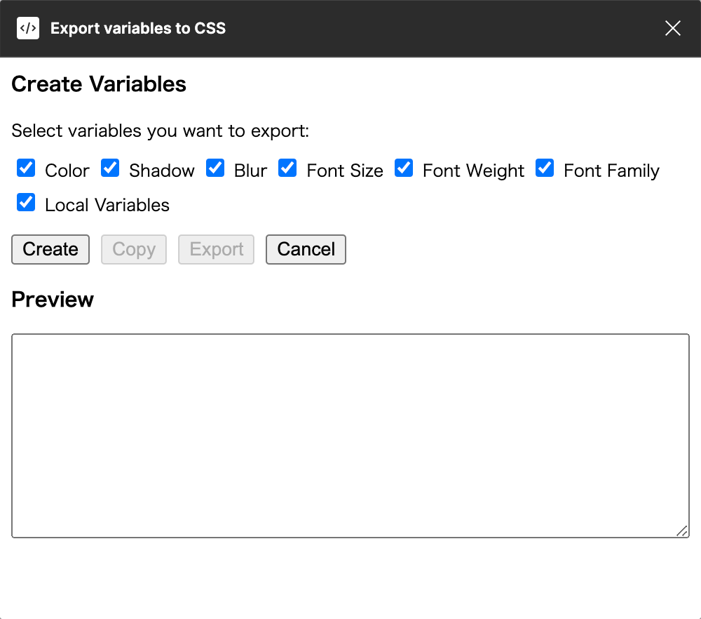

# Export Figma Variables to CSS

This is a simple Figma plugin that exports Figma variables to CSS.



## Supported Variables

- Local Paint Styles (Colors)
- Local Text Styles (Weights, Families, Sizes)
- Local Effect Styles (Shadows, Blurs)
- Local Variables

## Development

Run the plugin in development mode:

```bash
pnpm install
pnpm watch
```

And then, open figma and import the plugin on figma.
